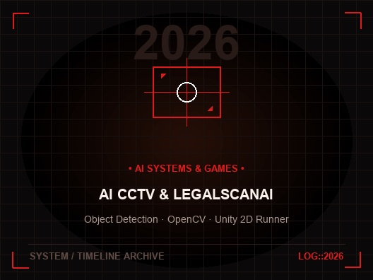

# JEYASURYA G — Cinematic Portfolio

> High-fidelity WebGL cinematic developer portfolio, technical project dossier, and interactive 3D timeline. Built with pure vanilla JavaScript and WebGL — no heavy runtime frameworks, no build step required.

🌐 **Live Website**: [https://jeyasurya.surge.sh](https://jeyasurya.surge.sh)



---

## ⚡ Overview

A performance-first, cinematic portfolio built for **Jeyasurya G** — Computer Science Engineering student, AI & Computer Vision developer, mobile and game creator.

- **Scene 01 — Monolithic Opening**: Dynamic 2D canvas glyph atlas rendered into WebGL with Anton heavy grotesque typography, distress grunge texturing, ambient red ember back-glow, and mouse-tracked camera parallax.
- **Scene 02 — The Tech Universe**: Interactive presentation of core technical proficiencies across AI, Computer Vision, Software Quality Assurance, and Mobile Development.
- **Scene 03 — A Journey Through Time (Chrono)**: Interactive 3D time machine featuring a sweeping clock raycast beam, rotating reflective floor mechanism, and 6 high-tech milestone cards spanning 2021 to 2027.
- **Scene 04 — Project Universe (Gallery)**: 3D interactive floating card gallery with physics-based depth float, yaw parallax, and click-through navigation.
- **Technical Project Dossier**: Exhaustive case studies, architecture dataflow pipelines, category filters (`AI & Computer Vision`, `Games & Mobile`, `Research & Awards`), and interactive HUD technical inspection modals.
- **Scene 06 — Cinematic Finale**: Breathing red ember fog, philosophical engineering quote, and direct contact buttons.

---

## 🛠 Tech Stack

- **Languages**: Python, Java, C, C#, Dart, JavaScript (ES6+ Modules), GLSL
- **Frameworks & Engines**: Unity Engine, Flutter, OpenCV, Android Studio
- **Graphics**: Pure WebGL 2.0 / 1.0, Canvas 2D Glyph Atlas, Custom Shaders
- **Testing & QA**: End-to-End Testing, Software Quality Assurance, Bug Triage

---

## 🚀 Featured Projects

1. **Object Detection CCTV Surveillance System** (Python, OpenCV)
   - Real-time multi-stream object and facial recognition surveillance pipeline.
   - Sub-second automated security alert dispatch for unidentified entities.
2. **LegalScanAI — Document Analysis Platform** (Python, NLP, QA)
   - Contract clause classification, compliance analysis, and automated QA test suites.
3. **2D Endless Runner Game** (Unity Engine, C#)
   - Physics-based locomotion motor, dynamic object pooling, procedural obstacle generation, 60 FPS performance.
4. **Guardian Union: Detect the Unseen**
   - **First Place & Best Project Award — NOVA 2K25 Project Expo**.
   - Low-visibility threat detection and intelligent perimeter analytics.
5. **Neural Link in Human Brain**
   - **Research Presentation at NETRIX 2024–2025 (KPR Institute of Technology)**.
   - BCI signal acquisition, neural telemetry, and non-invasive decoding matrices.
6. **Flutter Mobile Applications**
   - In-plant traineeship at Atalya Solutions Pvt. Ltd.; responsive cross-platform Android mobile architectures.

---

## 💻 Running Locally

No npm or build tools needed. Run with Python's built-in server or any static HTTP server:

```bash
python3 tools/serve.py 5173
```

Then open [http://localhost:5173](http://localhost:5173) in your browser.

---

## 📬 Contact & Profiles

- **Email**: [suryacloudcamp@gmail.com](mailto:suryacloudcamp@gmail.com)
- **Phone**: [+91 6379491821](tel:+916379491821)
- **GitHub**: [github.com/SuryaDevol](https://github.com/SuryaDevol)
- **LinkedIn**: [linkedin.com/in/jeyasurya-g](https://linkedin.com/in/jeyasurya-g)

---

&copy; 2026–2027 Jeyasurya G. All rights reserved.
